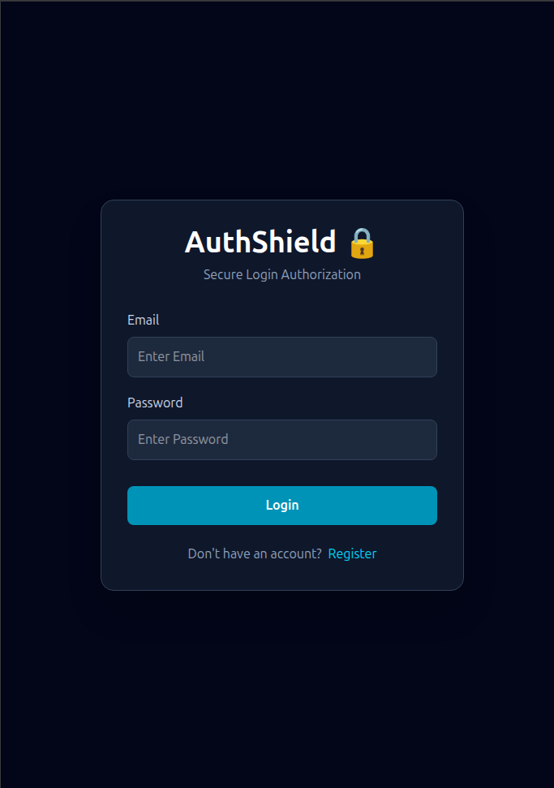
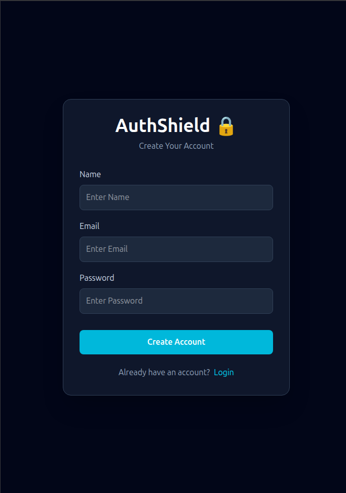
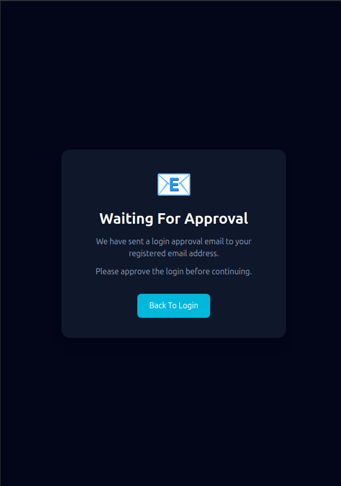
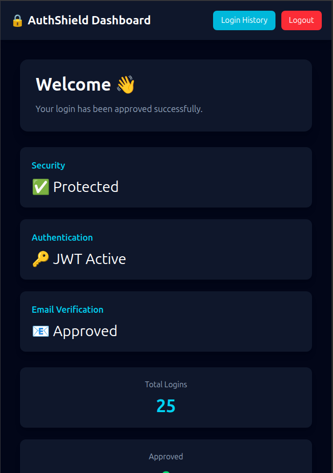

# 🔒 AuthShield – Secure Login Authorization System

A full-stack authentication system that adds an extra layer of security by requiring users to approve every login attempt through email before access is granted.

---

# 📌 Overview

Traditional authentication systems log users in immediately after validating their credentials. AuthShield enhances this process by sending an email containing **Approve** and **Reject** options whenever a login attempt is made.

The user can securely approve or reject the login request from the email. Access is granted only after approval, making the authentication process more secure against unauthorized login attempts.

---

# ✨ Features

- User Registration
- Secure Login
- Email-based Login Approval
- Approve Login
- Reject Login
- JWT Authentication
- BCrypt Password Encryption
- Login History Tracking
- Browser Detection
- IP Address Tracking
- Location Detection
- Responsive Dashboard
- Protected Routes
- Modern React UI

---

# 🛠 Tech Stack

## Backend

- Java 17
- Spring Boot
- Spring Security
- Spring Data JPA
- JWT (JSON Web Token)
- JavaMailSender
- MySQL
- Maven

## Frontend

- React
- Vite
- Tailwind CSS
- Axios
- React Router DOM

---

# 📂 Project Structure

```text
AuthShield

├── backend
│   ├── controller
│   ├── service
│   ├── repository
│   ├── entity
│   ├── dto
│   ├── security
│   └── config
│
├── frontend
│   ├── pages
│   ├── services
│   ├── assets
│   └── components
│
└── README.md
```

---

# 🔄 Workflow

```text
User Registration
        │
        ▼
User Login
        │
        ▼
Credentials Verified
        │
        ▼
Approval Email Sent
        │
        ▼
Approve / Reject Login
        │
        ▼
JWT Generated
        │
        ▼
Dashboard
        │
        ▼
Login History
```

---

# 🔐 Security Features

- BCrypt Password Hashing
- JWT Authentication
- Email Approval Workflow
- Secure REST APIs
- Login Request Expiration
- Login Approval/Rejection
- Browser Tracking
- IP Address Tracking
- Login History

---

# 📸 Screenshots
## Login Page



---

## Register Page



---

## Waiting For Approval



---

## Dashboard



# 🚀 Future Enhancements

- Two-Factor Authentication (2FA)
- Google OAuth Login
- Refresh Token Support
- Device Recognition
- Admin Dashboard
- Login Notification System
- Session Management
- Multi-Factor Authentication

---

# ⚙️ Installation

## Clone Repository

```bash
git clone https://github.com/YOUR_USERNAME/AuthShield-Secure-Login-Authorization-System.git
```

## Backend

```bash
cd backend
mvn spring-boot:run
```

## Frontend

```bash
cd frontend
npm install
npm run dev
```

---

# 📬 API Endpoints

| Method | Endpoint | Description |
|--------|----------|-------------|
| POST | `/auth/register` | Register User |
| POST | `/auth/login` | Login User |
| GET | `/auth/approve/{token}` | Approve Login |
| GET | `/auth/reject/{token}` | Reject Login |
| GET | `/auth/status/{token}` | Check Approval Status |
| GET | `/auth/dashboard/stats` | Dashboard Statistics |
| GET | `/history/{email}` | Login History |

---

# 👩‍💻 Author

**Samridhi Sharma**

---

⭐ If you found this project useful, consider giving it a star on GitHub!
